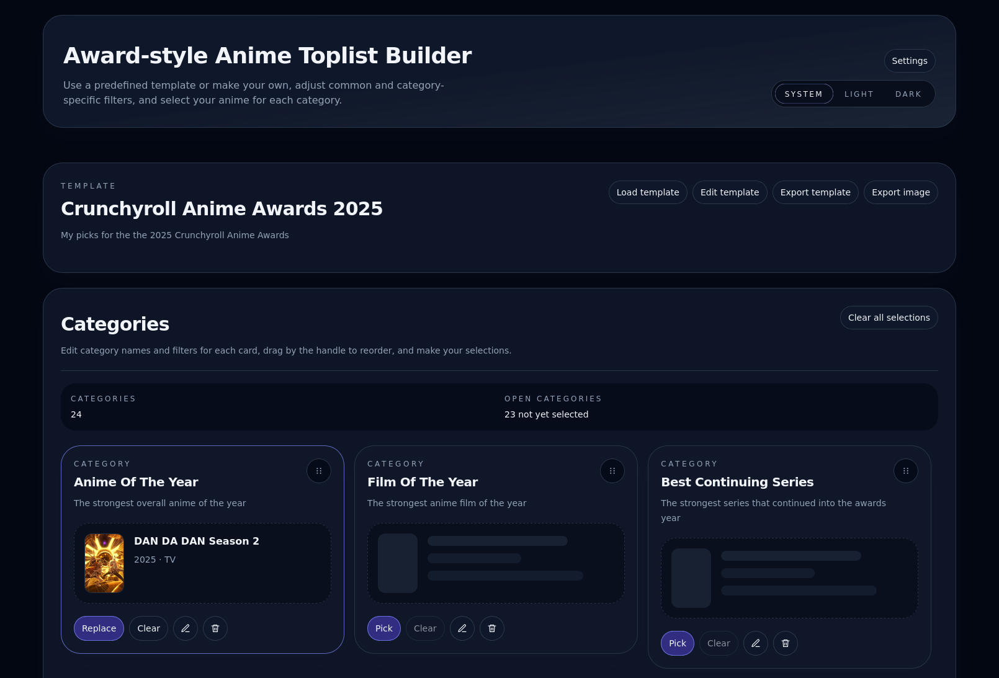
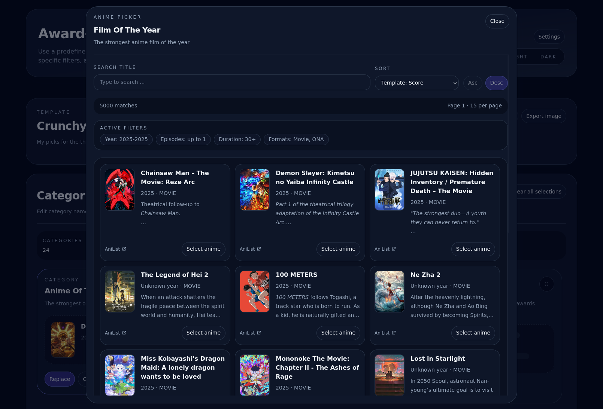

# Anime Toplist Builder

Anime Toplist Builder is a statically hosted Vue 3 app for building anime ranking templates.
It lets you manage templates, search AniList, persist local progress,
and export the current list as a themed PNG image.

## Screenshots

### Main page

### Anime picker

## Features

- Template management for predefined,
  local,
  file-imported,
  and remote URL templates.
- Fork-on-edit behavior for protected templates,
  including predefined templates and imported remote templates.
- Shared global filters plus category-specific filters,
  with deterministic merge rules and strict validation.
- Persistent anime selections keyed by stable template and category ids.
- Client-side AniList metadata loading and search.
- Remote template startup hydration via `#template=<id-or-url>`,
  plus last-opened template persistence.
- Theme toggle,
  title-language preferences,
  and toast feedback for template and selection actions.
- Browser-side PNG export that follows the current theme,
  category order,
  selected title language,
  and author name.
- Template JSON export and import with explicit schema validation.

## Stack

- Vue 3 with the Composition API and TypeScript.
- Vite for development and production builds.
- Pinia for shared state and local persistence.
- Tailwind CSS for styling.
- Reka UI for headless dialogs,
  menus,
  tooltips,
  and other primitives.
- SortableJS for category reordering.
- Vitest and Vue Test Utils for unit and component testing.
- ESLint for linting.
- `pnpm` for package and script management.

## Setup

1. Install dependencies with `pnpm install`.
2. Start the dev server with `pnpm dev`.
3. Open the local Vite URL shown in the terminal.

## Available Commands

- `pnpm dev`: start the local development server.
- `pnpm build`: create the production build in `dist/`.
- `pnpm preview`: serve the production build locally.
- `pnpm typecheck`: run `vue-tsc --noEmit`.
- `pnpm lint`: run ESLint across the repo.
- `pnpm test`: run the Vitest suite.

## Environment Notes

The app is fully client-side.
AniList requests run in the browser,
so no server secrets are required.

Useful optional environment variables:

- `VITE_APP_NAME`:
  app name shown in the UI.
- `VITE_REPOSITORY_URL`:
  repository link shown in the footer.
- `VITE_ANILIST_URL`:
  AniList link shown in the footer.
- `VITE_BASE_PATH`:
  base path for GitHub Pages or other subpath hosting.
- `VITE_DEFAULT_TEMPLATE_ID`:
  default template id used when there is no URL hash and no persisted last-opened template.
- `VITE_EXPORT_SITE_URL`:
  link embedded into PNG exports.

## Development Notes

- Template structure and anime selections are persisted separately.
- Category ids are stable internal identities.
  Renaming or reordering a category must not drop saved selections.
- Imported remote templates are stored locally and tracked by remote URL.
- Imported or predefined protected templates are forked before in-place edits.
- Removing a template also removes its stored selections.
- Global template edits and category edits share the same filter model.
- Remote templates can be loaded directly by hash,
  for example `#template=https%3A%2F%2Fexample.com%2Ftemplate.json`.
- PNG export runs in the browser canvas.
  Remote image hosts without suitable CORS headers may fall back to placeholders.

## Build And Deployment

The app targets static hosting,
including GitHub Pages.

1. Set `VITE_BASE_PATH` to the repository subpath when deploying under Pages.
2. Run `pnpm build`.
3. Publish the generated `dist/` directory with the existing Pages workflow.

## Known Issues and Constraints

- AniList currently exposes a single `tagRank` argument for tag queries,
  so the app collapses merged tag thresholds to the strictest rank.
  See `plans/2026-04-04-initial-implementation/step-4-deviations.md`.
- On FireFox, we use Sortable's fallback drag mode for category reordering.
  This avoids the browser's oversized native drag preview for the card.
- PNG export can fall back to placeholders when remote covers fail to load,
  including CORS-restricted images.
- The multi-select comboboxes exhibit some unexpected UX,
  for example the position swapping from the top to the bottom of the input
  or the scroll position being reset when an item is selected.
