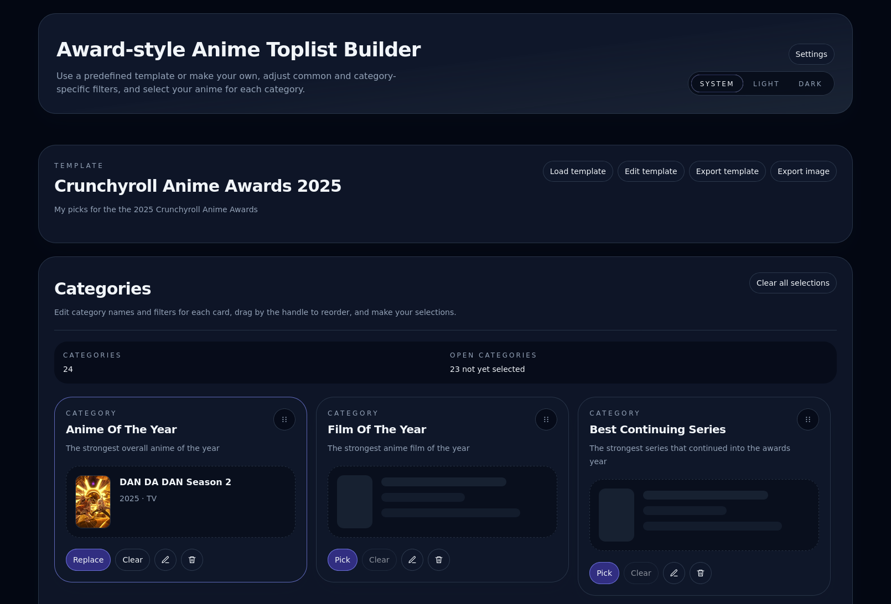
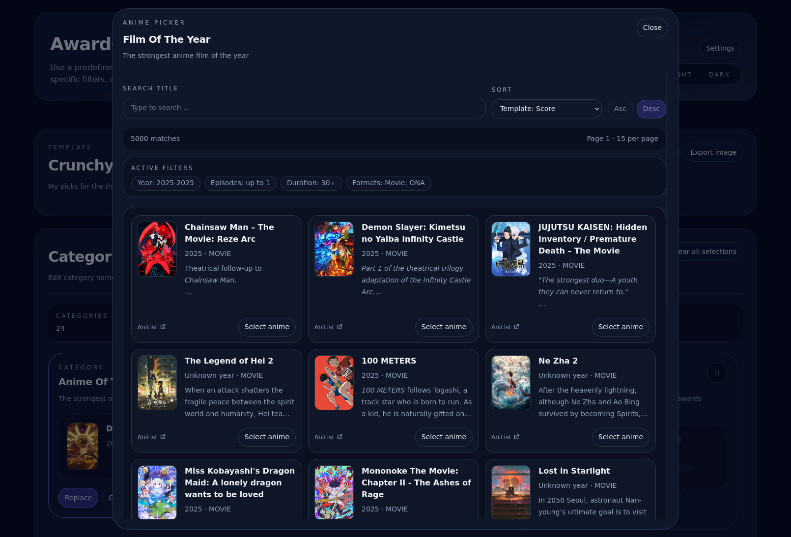

# Anime Toplist Builder Documentation

Anime Toplist Builder is a statically hosted browser app for building anime ranking lists
from templates,
filling them with anime or anime songs,
and exporting the result as a themed PNG image.

This `docs/` tree is the living documentation of how the site is supposed to behave.
It is updated together with the code,
not archived per feature.
Where a document and the code disagree,
the code is the truth and the document is a bug.

## Screenshots

### Main page

### Anime picker

## Usage Guide

Task-oriented documentation of the intended user flows.

- [Getting started](./guide/getting-started.md):
  what the app is,
  what loads on first visit,
  and how the page is laid out.
- [Templates](./guide/templates.md):
  template origins,
  switching,
  creating,
  importing,
  exporting,
  fork-on-edit,
  and sharing by URL.
- [Categories](./guide/categories.md):
  anime and song categories,
  editing,
  reordering,
  deleting,
  and what the cards show.
- [Filters](./guide/filters.md):
  the shared filter model,
  every filter field,
  and how the global filter combines with category filters.
- [Picking anime](./guide/picking-anime.md):
  the anime picker,
  search,
  sorting,
  pagination,
  and result states.
- [Picking songs](./guide/picking-songs.md):
  the two-step song picker,
  song type filters,
  previews,
  and caching.
- [Image export](./guide/image-export.md):
  layouts,
  author handling,
  filenames,
  and fallbacks.
- [Account and settings](./guide/account-and-settings.md):
  optional AniList connection,
  list filters,
  title language,
  and theme.

## Reference

Rules,
shapes,
and configuration that the guide relies on.

- [Data model](./reference/data-model.md)
- [Persistence](./reference/persistence.md)
- [Template JSON](./reference/template-json.md)
- [Architecture](./reference/architecture.md)
- [Configuration](./reference/configuration.md)
- [Limitations](./reference/limitations.md)

Contributor conventions live in [`AGENTS.md`](../AGENTS.md).
